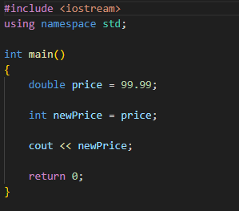

Variable name should start from \_ or a-z or A-Z 
variables are termed as <b>Identifiers</b> in C++

single digit = 1 bit 
8 bits = 1 byte

Data types -

1. int (4 bytes) -> 8\*4 -> 32bits -> we can store upto 32 integers
2. char (1 byte)
3. float (4 bytes)
4. bool (1 byte)
5. double (8 bytes)

If we don't use any type, by default it will be double

## Type casting

Converting data from one type to another

## Operators

1. Arithmetic : +,-,/,\*
2. Relational : <,>,<=,>=,!=,==
3. Logical : OR(|| pipe operator),AND(&& ampersend),NOT(!)

## Unary(Special) Operators

we need single operand(variable) to perform this operation

1. Increment(++)
   a++(post increment) -> will do the task first and update later
   ++a(pre increment) => will update first then will do the task
2. Decrement(--)

## Binary operators

we need 2 operands to perform this operation

## Conditional Statements

if-else

## Ternary Statement

meaning three 
condition ? statement1: statement2;

## Loops

1. while
2. do while
3. for

## ASCII characters

1. A-Z => 65-90
2. a-z => 97-122
