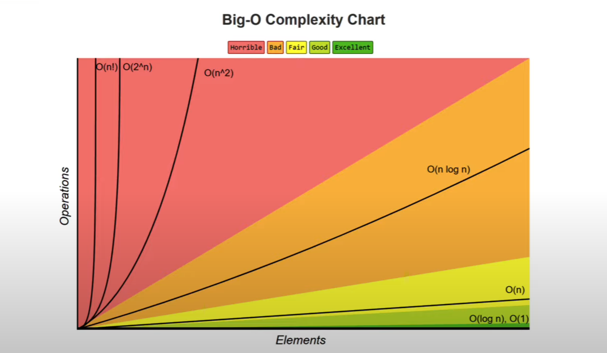

# Data structure

Way to organize data so that we can use it effeciently

### Types of Data structure

1. Primitive Data Structure : Integer, Float, Character, Pointer
2. Non-primitive Data Structure: Linear, Non-Linear

Linear :

1. Static -> Arrays  
2. Dynamic -> Vector, Linked list, Stack, Queue

Operation can be performed from start or at end

Non-Linear Lists : Tree, Graph, Table/Set  
Operation can be performed from anywhere

# Algorithm

Steps to structure the data as required or set of wee-defined instructions to solve a problem

### Characteristics

1. Well defined inputs and outputs
2. Each step should be clear and unambigous
3. Language independent

## Operations

1. Traverse: Read data/s
2. Insert
3. Deletion
4. Searching
5. Sorting
6. Merging

## Algorithm analysis

We evaluate the performance of an algorithm in terms of its input size

Time Complexity  Amount of time taken by an algorithm to run   
Space Complexity 
Amount of memory taken by an algorithm to run

## Time complexity

It can be done by asymptotic notations

1. Big-O Notation (O) - Worst case complexity
2. Omega Notation (&Omega;) - Best case complexity
3. Theta Notation (&theta;) - Average case complexity
       
   
       

O(1), O(logn) are very good  

O(2^n), O(n!) are really bad time complexities if possible
